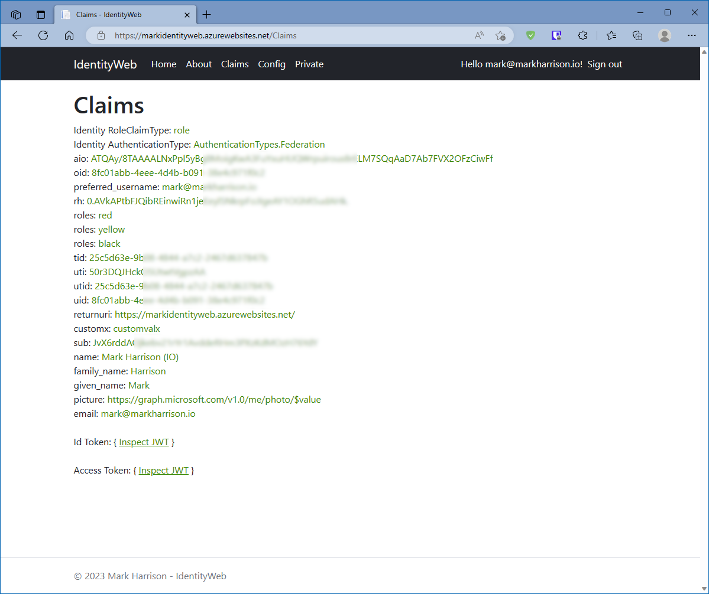

# IdentityWeb

https://markharrison.io/

7 March 2023 : Intial version

## Configuration

Environment variables / configuration 

| Key          | Value     |  
|--------------|-----------| 
| AzureAd__Instance | https://login.microsoftonline.com/  |  
| AzureAd__Domain | e.g. markharrison.io  |  
| AzureAd__TenantId | xxx  |  
| AzureAd__ClientId | xxx  |  
| AzureAd__ClientSecret | xxx  |  
| AzureAd__CallbackPath | /signin-oidc  |   
| APIURLRed | url  |   
| ScopesRedRead | scope  |   
| ScopesRedReadWrite | scope  |   
| APIURLYellow | url  |   
| ScopesYellowRead | scope  |   
| ScopesYellowReadWrite | scope  |   
| APIURLBlack | url  |   
| ScopesBlackRead | scope  |   
| ScopesBlackReadWrite | scope  |   
| ScopesGraph | User.Read  |   
| ASPNETCORE_FORWARDEDHEADERS_ENABLED | true/false |  

## Package 

<https://github.com/markharrison/IdentityWeb/pkgs/container/identityweb>

